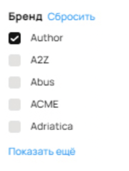
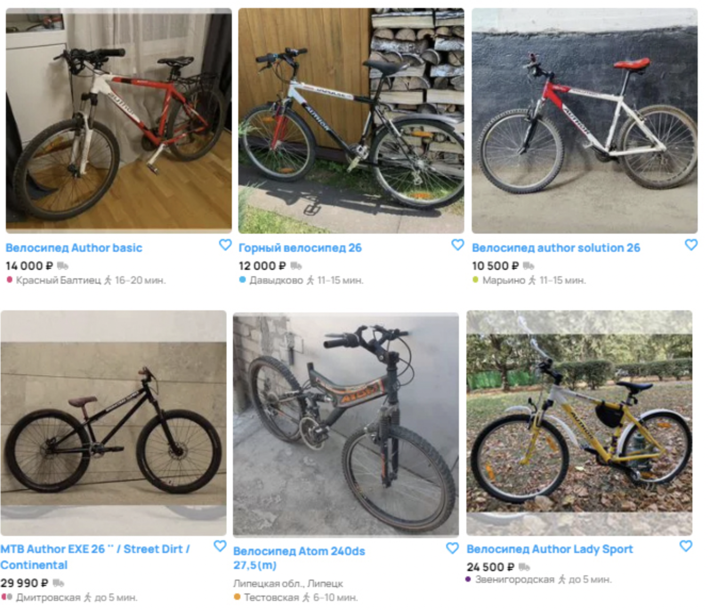
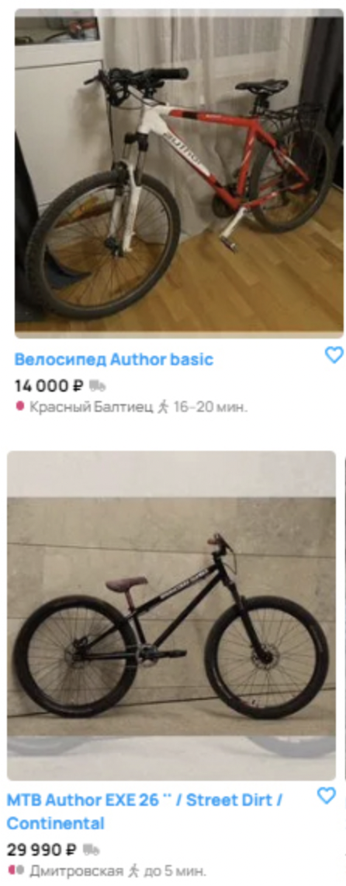

### 1.	Несоответствие фактических результатов поисковому фильтру
В фильтрах выставлен бренд «Author», но в списке есть объявление, где ни в названии, ни на изображении этот бренд не фигурирует.

 

Приоритет: High, так как нарушается логика поиска и это вводит в заблуждение покупателя.

### 2. Сортировка «Дороже» не работает корректно – объявления не упорядочены по убыванию цены
Выставлен фильтр «Дороже», но товары по цене не упорядочены

Приоритет: High, некорректная сортировка может приводить к тому, что потенциально нужное объявление с высокой ценой «теряется», а пользователь тратит больше времени на поиск.

### 3. Непонятное расхождение между количеством объявлений и пагинацией
Вверху страницы указано 61 объявление, в выборе фильтров "Показать 9 объявлений" но внизу есть кнопки страниц (1,2,3,4,5…100).
На странице объявлений больше 9. Возникает впечатление, что система показывает гораздо больше страниц, чем нужно для 61 объявления. Скорее всего, баг в механизме подсчёта количества страниц (или есть «заглушка», которая всегда показывает до «100»).

Приоритет: Medium, ошибка сбивает с толку пользователя, но не мешает купить товар напрямую.

### 4. Неровная верстка

Приоритет: Low, смещение элементов некритично и не мешает пользователю находить и использовать ключевые функции.