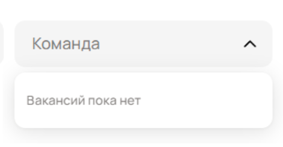
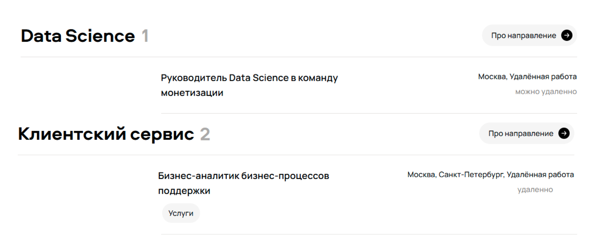
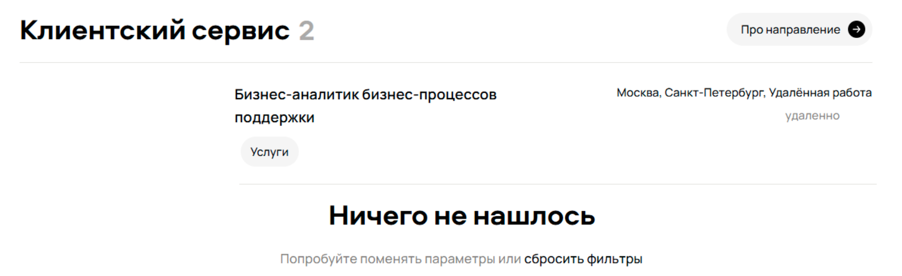
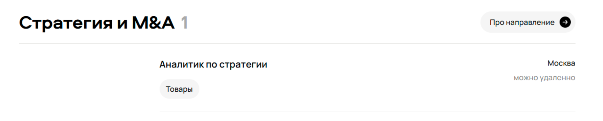
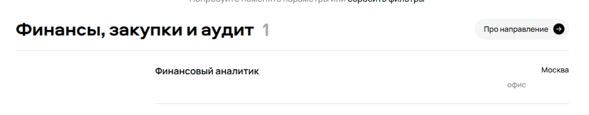
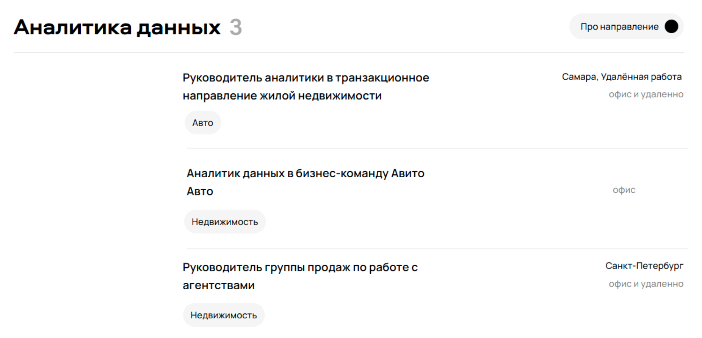
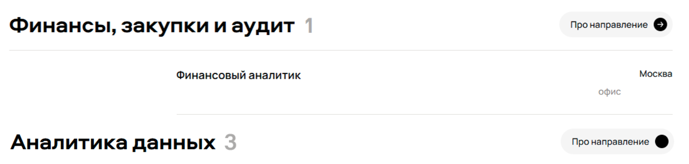

### 1.	Не верно работает фильтр по командам
В фильтре "Команда" показывается, что подходящих вакансий нет. При этом на странице есть вакансии

 

Приоритет: High, так как делает фильтры недостоверными и это вводит в заблуждение пользователя

### 2. Непонятная ошибка "Ничего не нашлось"
Под заголовком «клиентский сервис» показано, что найдено 2 вакансии, но ниже появляется блок "Ничего не нашлось"

Приоритет: Medium, это ошибка также может вводить пользователя в заблуждение, но функционал не ломает

### 3. Некорректная работа чекбоксов
Визуально галочки «Стажировка», «Руководящая роль», «Для людей с ОВЗ» никак не влияют на выдачу.
Мы выидим, что пользователь хочет получить только вакансии с «Руководящей ролью», но при этом в выборке есть не только они

Приоритет: Medium, вводит в заблуждение, но не ломает основной функционал

### 4. Фильтр "Можно удалённо" работает некорректно
При выбранном фильтре "Можно удаленно" в списке есть вакансии с работой в офисе

Приоритет: High, ломает основную логику фильтра, пользователь получает нерелевантные результаты

### 5. Неровная верстка
Неровное выравнивание статусов («офис», «офис и удалённо») в колонке локаций

Приоритет: Medium, не ломает логику, но нарушает визуальную целостность и мешает быстрому просмотру списка

### 6. Неверные категории вакансий
Неверные плашки категорий («Авто» / «Недвижимость») у вакансий

Приоритет: Medium, не ломает функционал, но вводит пользователя в заблуждение

### 7. Разное отображение кнопок
Кнопки "Про направление" выглядят по-разному (наличие и отсутсвие стрелки)

Приоритет: Low, нарушает консистентность дизайна