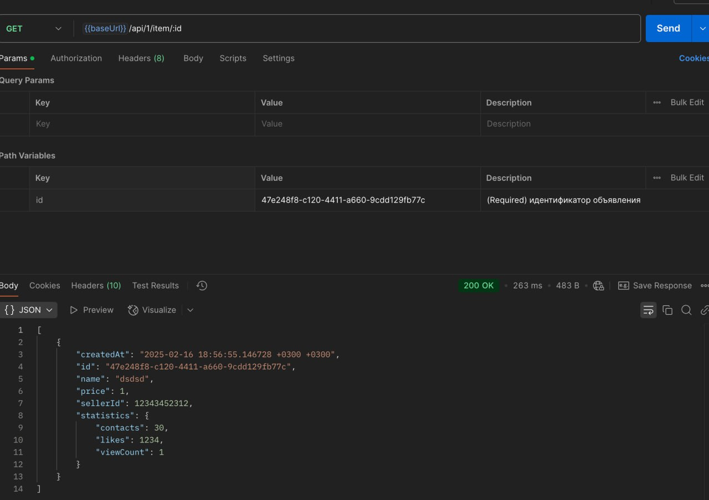
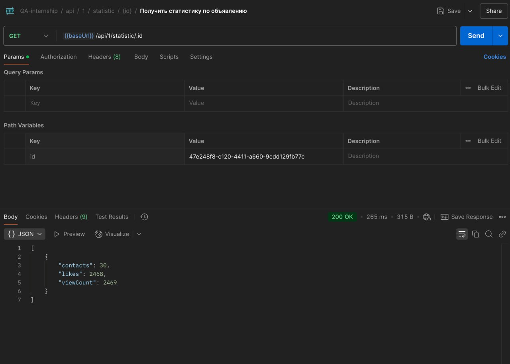

### 1. Несоответствие статистики в методах GET /api/1/item/:id и GET /api/1/statistic/:id

Шаги для воспроизведения:
1. Отправить запрос GET /api/1/item/{id}, где {id} — идентификатор объявления (на скриншоте: 47e248f8-c120-4411-a660-9cdd129fb77c). 
2. Обратить внимание на поля в блоке statistics (например, "likes", "viewCount", "contacts"). 
3. Отправить запрос GET /api/1/statistic/{id} с тем же идентификатором. 
4. Сравнить значения полей likes, viewCount, contacts, полученных во втором методе, с теми, что вернулись в первом методе.

Ожидаемый результат:
Методы GET /api/1/item/:id и GET /api/1/statistic/:id возвращают одинаковые данные статистики (likes, viewCount, contacts) для одного и того же id.

Фактический результат (Actual result): первый метод (GET /api/1/item/:id) возвращает, например, "likes": 1234, "viewCount": 1; второй метод (GET /api/1/statistic/:id) для того же id возвращает другие значения (например, "likes": 2468, "viewCount": 2469).

Приоритет: High, важная несостыковка, из‑за которой пользователь может некорректно интерпретировать статистику объявления.

### 2. Метод создания/редактирования объявления возвращает 200 вместо ожидаемого 400 при пустом названии объявления

Шаги для воспроизведения (Steps to reproduce):
1. Вызвать метод POST /api/1/item с телом запроса:
{
  "name": "",
  "price": 100,
  "sellerID": 918273645,
  "statistics": {
    "contacts": 5,
    "likes": 10,
    "viewCount": 20
  }
}
Ожидаемый результат: Сервер возвращает HTTP 400 (Bad Request) в случае пустого поля name, так как это невалидные данные.

Фактический результат: Сервер отвечает кодом HTTP 200, что указывает на успех операции, несмотря на то, что name пустое и по логике валидации должно быть отклонено.

Приоритет: High, логическая ошибка валидации полей, система некорректно принимает «некорректные» данные, что может приводить к созданию неверных записей.

### 3. Система разрешает установку отрицательной цены в объявлении (ожидался 400, приходит 200)

Шаги для воспроизведения:
1. Отправить запрос создания объявления с телом:
{
  "name": "Item Name",
  "price": -50,
  "sellerID": 918273645,
  "statistics": {
    "contacts": 5,
    "likes": 10,
    "viewCount": 20
  }
}

Ожидаемый результат: Сервер возвращает 400 Bad Request, так как цена не должна быть отрицательной согласно правилам.

Фактический результат: Сервер возвращает 200 OK, тем самым указывая, что создание с отрицательной ценой прошло успешно.

Приоритет:High, критическая логическая ошибка в валидации данных — система допускает «некорректную» цену.

### 4. Отсутствие поля sellerID при создании объявления не приводит к ошибке (возвращается 200 вместо 400)

Шаги для воспроизведения:
1. Отправить запрос на создание объявления (например, POST /api/1/item) со следующим телом:
{
  "name": "Test item",
  "price": 100,
  "statistics": {
    "contacts": 5,
    "likes": 10,
    "viewCount": 20
  }
}

Ожидаемый результат: Сервер возвращает ошибку 400 Bad Request, указывая, что обязательный параметр sellerID отсутствует.

Фактический результат: Сервер возвращает 200 OK, и объявление создаётся без sellerID.

Приоритет: High, может приводить к некорректной работе с объявлениями, усложняет логику отслеживания продавцов.

### 5. Метод GET /api/1/item/:id всегда возвращает name = "dsdsd" вместо реального названия

Шаги для воспроизведения:
1. Создать объявление или использовать уже существующее с реальным именем (например, "name": "Телефон").
2. Вызвать метод GET /api/1/item/{id}, передав идентификатор созданного объявления.
3. Посмотреть значение name в ответе.

Ожидаемый результат: Метод возвращает корректное значение name, соответствующее данным, которые были указаны при создании).

Фактический результат: В ответе в поле name всегда прописано "dsdsd", независимо от того, какое имя было задано.

Приоритет: Medium, ошибка не блокирующая, но приводит к тому, что пользователь не видит реальные названия объявлений.

### 6. Метод GET /api/1/:sellerID/item возвращает перепутанные поля: name и id не соответствуют действительности

Шаги для воспроизведения (Steps to reproduce):
1. Создать несколько объявлений одного и того же продавца.
2. Вызвать метод получения объявлений по продавцу
3. Сравнить поля name и id в ответе с данными, которые были заданы при создании.

Ожидаемый результат: Возвращаются корректные пары «id объявления + его name», id в ответе соответствует реальному идентификатору объявления, а name — названию, которое было указано при создании.

Фактический результат: Значения полей name и id местами перепутаны или указывают на некорректные данные.

Приоритет: Medium, логическая несостыковка, путает пользователя и разработчиков, затрудняет поиск/отображение объявлений.